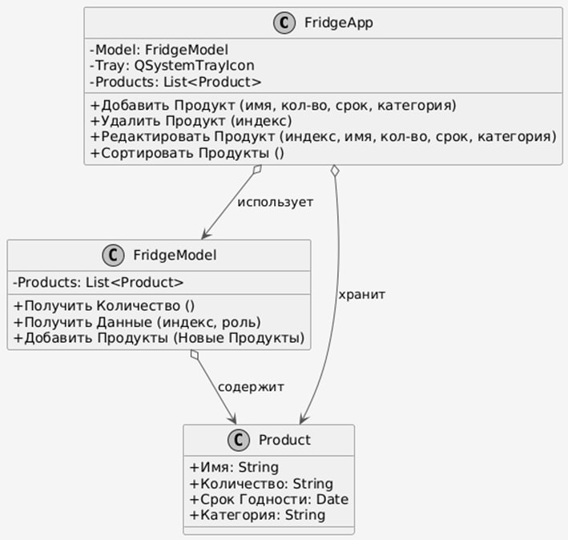
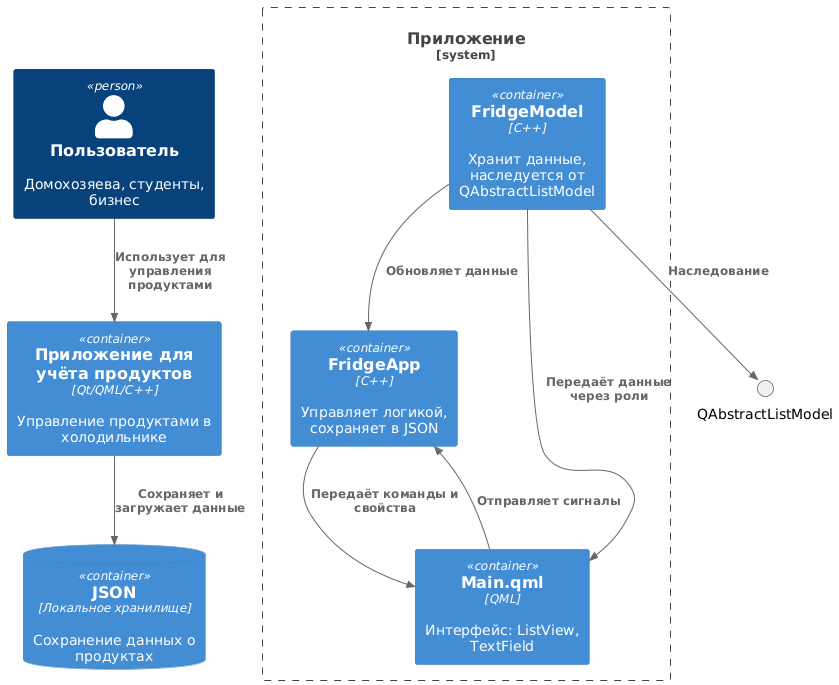

# Fridge — Qt-приложение для управления холодильником
Простое графическое приложение на C++ и QML (Qt 6) для управления виртуальным холодильником. Демонстрирует работу с моделью/представлением, QML-интерфейсом и управлением ресурсами.
## 🛠️ Требования

- Qt: Версия 6.5 или выше (рекомендуется Qt 6.5.3)
- CMake: Версия 3.16 или выше
- Компилятор: GCC, Clang или MSVC (совместимый с Qt 6)
- Qt Creator: Опционально, для удобной настройки и сборки проекта
- Операционная система: Windows, macOS или Linux

# 🔧 Инструкции по сборке
### Вариант 1: Использование Qt Creator

1. Откройте Qt Creator.
2. Выберите Файл > Открыть файл или проект и укажите CMakeLists.txt в корне проекта.
3. Настройте проект, выбрав комплект Qt 6 (убедитесь, что используется Qt 6.5+).
4. Нажмите Собрать (Ctrl+B или Cmd+B) для компиляции проекта.
5. Нажмите Запустить (Ctrl+R или Cmd+R) для запуска приложения.

### Вариант 2: Использование терминала

1. Склонируйте или скачайте репозиторий и перейдите в папку проекта.
2. Создайте директорию для сборки и выполните CMake:
```bash
mkdir build && cd build
cmake ..
```
3. Скомпилируйте проект:
```bash
cmake --build .
```
4. Запустите приложение:
```bash
./appFridge
```

Примечание: На Windows исполняемый файл может находиться в папке build/Debug или build/Release (например, Debug\appFridge.exe).


## 🖼️ Пользовательский интерфейс
Приложение имеет интерфейс на основе QML с:
- Списком продуктов в холодильнике.
- Кнопками для добавления (+) и удаления (🗑) продуктов.
- Визуальными элементами, такими как изображения и иконки для продуктов.
- Динамическим обновлением списка продуктов через модель/представление.

## 📁 Структура проекта
- main.cpp: Точка входа, инициализирует движок QML и настраивает контекст приложения.
- Main.qml: Определяет основной пользовательский интерфейс.
- fridge_model.h/cpp: Реализует класс FridgeModel, наследуемый от QAbstractListModel, для управления данными о продуктах.
- fridge_app.h/cpp: Обеспечивает связь между FridgeModel и QML-интерфейсом.
- resources.qrc: Содержит ресурсы, такие как изображения и иконки.
- CMakeLists.txt: Конфигурация CMake для сборки проекта.

## 🧱 Архитектура
1. UML-диаграмма (диаграмма классов)
Ниже представлена UML-диаграмма, описывающая основные классы и их связи:




- FridgeModel: Наследуется от QAbstractListModel, управляет списком объектов FridgeItem и предоставляет данные для QML-представления.
- FridgeItem: Представляет отдельный продукт с атрибутами, такими как название и иконка.
- FridgeApp: Класс на основе QObject, предоставляющий FridgeModel для QML.

2. C4-модель (уровень контейнеров)
C4-модель иллюстрирует архитектуру высокого уровня:



Пользователь: Взаимодействует с графическим интерфейсом на основе QML.
Интерфейс Fridge (QML): Отображает интерфейс и обрабатывает действия пользователя.
FridgeApp (C++): Связывает интерфейс с моделью данных.
FridgeModel (C++): Управляет данными (списком продуктов).

## 📘 Пользовательская документация
### 🟢 Краткое руководство
1. Запустите приложение, следуя инструкциям по сборке выше.
2. Заполните небходимые строки.
3. Нажмите кнопку Добавить, чтобы добавить новый продукт в холодильник.
4. Выберите продукт из списка и нажмите иконку удалить для его удаления.

## ❓ Часто задаваемые вопросы (FAQ)

В: Почему приложение не запускается?

О: Убедитесь, что Qt 6.5+ установлен и добавлен в переменную PATH вашей системы. Проверьте совместимость компилятора с Qt.

В: Почему не отображаются иконки или изображения?

О: Убедитесь, что файл resources.qrc включён в проект и пути к ресурсам указаны корректно. Пересоберите проект.

В: Где хранятся данные?

О: Данные хранятся в оперативной памяти и не сохраняются после закрытия приложения.

В: Можно ли сохранять список продуктов?

О: На данный момент нет. В будущих версиях может быть добавлена поддержка постоянного хранения (например, JSON или SQLite).


